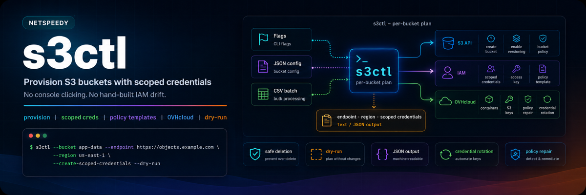
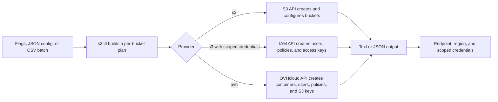

<p align="center">
  
</p>

<p align="center">
  <a href="https://github.com/netspeedy/s3ctl/actions/workflows/build-and-validate.yml"></a>
  <a href="https://github.com/netspeedy/s3ctl/actions/workflows/container-image.yml"></a>
  <a href="https://github.com/netspeedy/s3ctl/releases"></a>
  <a href="https://github.com/netspeedy/homebrew-s3ctl"></a>
  <a href="https://netspeedy.github.io/s3ctl/"></a>
  <a href="https://github.com/netspeedy/s3ctl/pkgs/container/s3ctl"></a>
  <a href="https://go.dev/"></a>
</p>

---

## Install

**Homebrew** (macOS and Linux — recommended):

```bash
brew tap netspeedy/s3ctl
brew install s3ctl
```

**Direct installer** (single command, handles macOS quarantine cleanup):

```bash
curl -fsSL https://netspeedy.github.io/s3ctl/install.sh | bash
```

Debian/Ubuntu APT, pinned versions, and the GHCR container image are covered in
[docs/installation.md](docs/installation.md).

**Docs:** [Website](https://netspeedy.github.io/s3ctl/) · [Install](docs/installation.md) · [Usage](docs/usage.md) · [OVHcloud](docs/ovhcloud.md) · [Release](docs/release.md) · [Examples](examples) · [Releases](https://github.com/netspeedy/s3ctl/releases)

---

## Overview

`s3ctl` provisions S3-compatible buckets and automatically issues bucket-scoped
access credentials for each one. It works with any S3/IAM-compatible provider,
or with OVHcloud Public Cloud Object Storage, and runs the whole lifecycle —
create, version, policy, credential rotation, and safe deletion — from a single
command driven by flags, JSON config, or CSV batch input.

It is designed for the common operational workflow:

- create one or many buckets
- optionally enable versioning
- optionally apply a bucket policy from a built-in template or JSON file
- create a fresh access key and secret key for each bucket
- attach a generated policy so each credential only has access to its own bucket
- rotate existing OVHcloud S3 credentials by bucket name
- delete empty buckets safely, or delete non-empty buckets with an explicit force guard
- drive the same workflow from flags, JSON config, or CSV batch input



---

## Capabilities

- **Bucket provisioning**: creates one bucket, many buckets, or CSV-driven batches
- **Scoped credentials**: creates bucket-specific IAM-style users and access keys
- **Built-in policy templates**: applies ready-made bucket policies and scoped-credential policies without hand-writing JSON
- **OVHcloud support**: creates containers, Public Cloud users, S3 keys, policies, and optional encryption
- **Credential rotation**: rotates OVHcloud S3 keypairs by bucket/user name
- **OVHcloud policy repair**: reapplies scoped S3 user policies to existing bucket users
- **Safe deletion**: deletes empty buckets without `--force` and requires `--force` for non-empty buckets
- **Dry-run and JSON output**: previews every action and emits machine-readable success and error payloads

---

## Quick start

`s3ctl` is a single command with no subcommands to memorize — run `s3ctl --help`
for a short operator quick reference, or `s3ctl --help-full` for the complete
flag, template, and CSV field reference.

Plan a single bucket with generated scoped credentials:

```bash
s3ctl \
  --bucket app-data \
  --endpoint https://objects.example.com \
  --region us-east-1 \
  --create-scoped-credentials \
  --dry-run
```

Provision an OVHcloud Object Storage container and a dedicated S3 key:

```bash
s3ctl \
  --provider ovh \
  --bucket app-data \
  --region UK \
  --ovh-service-name PUBLIC_CLOUD_PROJECT_ID \
  --output json
```

> For the `ovh` provider, `--region` is an OVHcloud Public Cloud region such as
> `UK`, `GRA`, `BHS`, `SBG`, or `EU-WEST-PAR` — not an AWS-style region like the
> `us-east-1` used by the default `s3` provider above.

Beyond creating buckets, `s3ctl` runs the rest of the bucket lifecycle from the
same command:

```bash
# Rotate an existing OVHcloud bucket keypair
s3ctl --provider ovh --bucket app-data --ovh-rotate-credentials --output json

# Re-scope an existing OVHcloud bucket user policy
s3ctl --provider ovh --bucket app-data --ovh-repair-policies --output json

# Delete an empty bucket (preview first with --dry-run)
s3ctl --bucket app-data --delete --dry-run
s3ctl --bucket app-data --delete                 # empty bucket, no --force needed
s3ctl --bucket app-data --delete --force         # non-empty bucket requires --force

# Show the installed version (add --output json for a machine-readable payload)
s3ctl --version
```

See [docs/usage.md](docs/usage.md) for batch provisioning, credential rotation,
policy repair, bucket deletion, JSON config, and full CLI usage examples, and
[docs/ovhcloud.md](docs/ovhcloud.md) for OVHcloud setup and provider-specific
behaviour.

### First bucket checklist

1. Put shared provider settings in `~/.config/s3ctl/config.json`.
2. Run `s3ctl --bucket app-data --dry-run --output json`.
3. Confirm the endpoint, region, and credential scope in the plan.
4. Run `s3ctl --bucket app-data --output json`.
5. Store the returned access key and secret securely; secrets are only printed once.

---

## Usage

`s3ctl` can run one bucket at a time, multiple buckets from repeated `--bucket`
flags, or CSV batches from `--batch-file`. Shared defaults can live in JSON
config, while command-specific values stay in flags. Configuration is resolved
in this order: CLI flags, then JSON config, then built-in defaults.

The full reference — batch input, JSON config, IAM permissions, and JSON error
payloads — lives in [docs/usage.md](docs/usage.md). The built-in policy templates
and the flags most operators reach for are summarised below.

<details>
<summary><strong>Built-in policy templates</strong></summary>

`s3ctl` ships two distinct sets of templates. **Bucket policy templates** are
attached to the bucket itself (S3 provider only); **scoped-credential policy
templates** are attached to the IAM/OVH user that `--create-scoped-credentials`
generates.

Bucket policy templates (`--bucket-policy-template`):

| Template | Coverage |
| --- | --- |
| `deny-insecure-transport` | Denies all S3 actions against the bucket and objects when requests do not use secure transport. |
| `public-read` | Allows public `s3:GetObject` access to objects in the bucket. |

Scoped-credential policy templates (`--credential-policy-template`, default `bucket-readwrite`):

| Template | Coverage |
| --- | --- |
| `bucket-readonly` | Bucket location lookup, bucket listing, and object reads for one bucket. |
| `bucket-readwrite` | Bucket location lookup, listing, object reads, writes, deletes, and multipart uploads for one bucket. |
| `bucket-admin` | All S3 actions against one bucket and its objects. |

</details>

<details>
<summary><strong>Common flags</strong></summary>

`s3ctl` exposes 40+ flags; these are the ones most operators reach for. Run
`s3ctl --help-full` for the complete reference.

| Flag | Purpose |
| --- | --- |
| `--provider s3\|ovh` | Provider to target; defaults to `s3` |
| `--bucket` | Bucket name; repeat for many, or use `--batch-file` for CSV |
| `--config` / `-c` | Path to a JSON config file |
| `--endpoint` / `--region` | S3 endpoint and region |
| `--create-scoped-credentials` | Create an IAM/OVH user and access key scoped to each bucket |
| `--credential-policy-template` | Scoped-credential template (default `bucket-readwrite`) |
| `--bucket-policy-template` / `--bucket-policy-file` | Built-in or custom bucket policy |
| `--enable-versioning` | Enable bucket versioning after creation |
| `--delete` | Delete buckets instead of creating them (`--force` for non-empty) |
| `--ovh-rotate-credentials` | Rotate OVHcloud S3 keypairs (OVHcloud only) |
| `--ovh-repair-policies` | Re-apply scoped OVHcloud user policies (OVHcloud only) |
| `--dry-run` | Show the planned actions without making changes |
| `--output text\|json` | Output format; defaults to `text` |
| `--timeout` | Overall operation timeout; defaults to `10m` |
| `--version` | Print version information |
| `--help` / `--help-full` | Short reference / complete flag, template, and CSV reference |

</details>

---

## OVHcloud notes

Use `--provider ovh` to create OVHcloud Object Storage through the Public Cloud
API. OVHcloud calls buckets "containers"; `s3ctl` keeps the CLI wording as
bucket because the resulting credentials are S3-compatible.

The OVHcloud provider creates one Public Cloud user and one S3 credential pair
per bucket, creates the container in `--region`, attaches the user to that
container with the matching OVHcloud container profile (`readWrite` by default),
and imports an OVHcloud S3 user policy scoped to that bucket.

The generated OVHcloud user policy prevents project-wide bucket enumeration, and
JSON output reports the container/S3 user policy as
`scoped_access_policy_applied`. Bucket policy documents are not applied for the
OVHcloud provider; access is controlled through OVHcloud container profiles and
S3 user policies.

Required OVHcloud settings:

- `provider`: `ovh`
- `ovh_service_name`: the Public Cloud project ID/service name
- one OVHcloud auth mode: OAuth2 service account credentials, an access token,
  classic OVH API application credentials, or standard go-ovh client discovery
  such as `ovh.conf`
- `region`: an OVHcloud Public Cloud/Object Storage region such as `UK`, `GRA`,
  `BHS`, `SBG`, or `EU-WEST-PAR`

See [docs/ovhcloud.md](docs/ovhcloud.md) for OAuth2 service account setup,
least-privilege IAM actions, storage policy roles, credential rotation, policy
repair, and OVHcloud bucket deletion details.

---

## Container

Build locally:

```bash
make docker-build
docker run --rm s3ctl:dev
```

Use the published image:

```bash
docker run --rm ghcr.io/netspeedy/s3ctl:latest
```

Run against the bundled examples from the host:

```bash
docker run --rm \
  -v "$PWD/examples:/examples:ro" \
  ghcr.io/netspeedy/s3ctl:latest \
  --config /examples/aws/s3ctl.json \
  --dry-run \
  --output json
```

---

## Release process

Stable releases publish Linux and macOS archives, Debian packages, signed checksums,
GHCR images, release-hub metadata, and signed APT repository metadata. Release
candidates use tags such as `v1.2.3-rc.1` while a version is being validated.

See [docs/release.md](docs/release.md) for release, website preview, and
dependency update notes.

---

## Development

Build locally:

```bash
make build
./dist/s3ctl --help
```

Run the main checks:

```bash
make lint-install
make fmt-check
make lint
make vet
make test
make build
```

Format, build release artifacts, and preview the website:

```bash
make fmt
make build-release
make website-install
make website-build
make website-capture
```

`gofmt` is the baseline formatter. The pinned `golangci-lint` configuration adds
`gofumpt`, `goimports`, `staticcheck`, `errcheck`, and `revive`.

---

## Project structure

```text
s3ctl/
├── assets/                   # README and repository imagery
├── cmd/s3ctl/                # CLI entrypoint
├── internal/                 # CLI, provider, and build metadata packages
├── docs/                     # OVHcloud and release documentation
├── examples/
│   ├── aws/                  # Generic S3 JSON and CSV examples
│   └── ovh/                  # OVHcloud config and policy examples
├── scripts/
│   ├── install.sh            # Public installer copied to the website
│   ├── package/              # Debian and apt repository helpers
│   ├── release/              # Release notes and tag workflow helpers
│   └── toolchain/            # Go and lint toolchain helpers
├── .github/
│   ├── assets/website/       # GitHub Pages release hub
│   └── workflows/            # Validation and release automation
├── AGENTS.md                 # Repository rules for coding agents
├── Dockerfile                # Container image build
├── Makefile                  # Local validation and release targets
├── LICENSE                   # MIT License
├── go.mod                    # Go module and toolchain version
└── README.md                 # Project overview
```

---

## Contributing

Issues and pull requests are welcome at [netspeedy/s3ctl](https://github.com/netspeedy/s3ctl).
The development commands above are the expected minimum validation before a
change lands; see [AGENTS.md](AGENTS.md) for the full repository conventions.
Releases are automated; see [docs/release.md](docs/release.md).

---

## License

Copyright © 2026 [Simon Oakes](https://github.com/soakes). Released under the
[MIT License](LICENSE).

`s3ctl` is an unofficial community tool and is not affiliated with, endorsed by,
or sponsored by AWS, Amazon S3, or OVHcloud.
