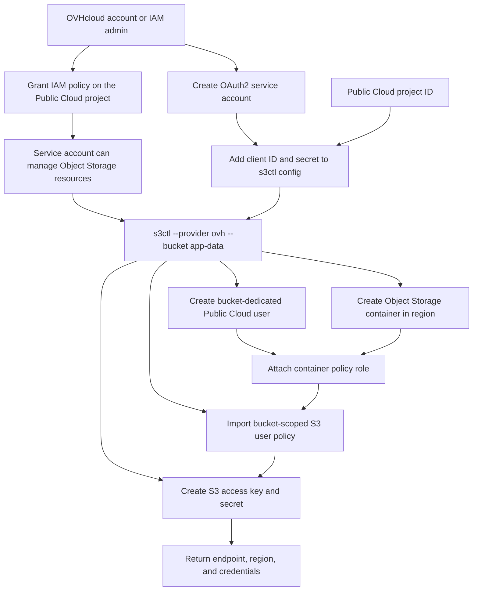

# OVHcloud Object Storage

Use `--provider ovh` to create OVHcloud Object Storage through the Public Cloud
API. OVHcloud calls buckets "containers"; `s3ctl` keeps the CLI wording as
bucket because the resulting credentials are S3-compatible.

The OVHcloud provider creates one Public Cloud user and one S3 credential pair
per bucket, creates the container in `--region`, attaches the user to that
container with the matching OVHcloud container profile (`readWrite` by default),
and imports an OVHcloud S3 user policy scoped to that bucket.

It does not apply S3 bucket policy documents; access is controlled through
OVHcloud container profiles and S3 user policies. The `replication` policy
profile uses OVHcloud's native `admin` container profile plus an imported S3
user policy that keeps access scoped to the bucket and denies
bucket-administration writes.

## Required settings

- `provider`: `ovh`
- `ovh_service_name`: the Public Cloud project ID/service name
- one OVHcloud auth mode: OAuth2 service account credentials, an access token,
  classic OVH API application credentials, or standard go-ovh client discovery
  such as `ovh.conf`
- `region`: an OVHcloud Public Cloud/Object Storage region such as `UK`, `GRA`,
  `BHS`, `SBG`, or `EU-WEST-PAR`

Use the uppercase region returned by OVHcloud's Public Cloud API. `s3ctl` also
accepts lowercase S3 endpoint regions such as `uk` and normalizes them for
OVHcloud API calls.

## Optional settings

- `ovh_api_endpoint`: endpoint name such as `ovh-eu`, `ovh-ca`, `ovh-us`, or a custom API URL
- `ovh_client_id` and `ovh_client_secret`: OAuth2 service account credentials
- `ovh_access_token`: short-lived OVHcloud access token
- `ovh_application_key`, `ovh_application_secret`, and `ovh_consumer_key`: classic OVH API application credentials
- `ovh_s3_endpoint`: override the returned S3 endpoint when the default
  `https://s3.<region>.io.cloud.ovh.net` form is not right for your project
- `ovh_user_role`: defaults to `objectstore_operator`
- `ovh_storage_policy_role`: one of `admin`, `deny`, `readOnly`, `readWrite`, or
  `replication`
- `ovh_encrypt_data`: set to `true` to enable OVHcloud server-side encryption
  with OVH-managed keys (`AES256` / SSE-OMK)
- `ovh_tags`: optional tags to apply to new OVHcloud containers
- `ovh_rotate_credentials`: set to `true` to rotate S3 credentials for the
  existing OVHcloud container owner instead of creating a new container
- `ovh_repair_policies`: set to `true` to reapply the OVHcloud container
  profile and S3 user policy for existing bucket owners without issuing new
  credentials

Use `replication` only for buckets that act as replication targets; it allows
bucket versioning/configuration reads and replication target object actions
supported by OVHcloud while remaining scoped to the bucket.

When `ovh_encrypt_data` is explicitly set to `false`, `s3ctl` requests OVHcloud
`plaintext` container storage.

Use JSON config such as
`"ovh_tags": {"environment": "prod", "owner": "platform"}`, or repeat
`--ovh-tag environment=prod --ovh-tag owner=platform`.

## Access policy behaviour

The generated OVHcloud user policy denies `s3:ListAllMyBuckets` so a bucket key
cannot enumerate every bucket in the project. Use `mc ls alias/bucket-name` to
list objects in the bucket. Bare `mc ls alias` uses the S3 account-level bucket
listing API, which OVHcloud documents as all-buckets or denied rather than a
reliable single-bucket filtered result.

JSON output reports this OVHcloud container/S3 user policy as
`scoped_access_policy_applied`. `bucket_policy_applied` is only emitted when an
S3 bucket policy document was actually applied.

For `readOnly` and `readWrite`, `s3ctl` also adds explicit deny statements for
unsupported operations on the owned bucket. OVHcloud currently falls back to the
bucket owner's ACL when a user policy has no matching allow or deny, so explicit
denies are required for owner-scoped users.

## OAuth2 and IAM setup



Create the OAuth2 service account first. The official `ovhcloud` CLI is the
cleanest route.

Install the CLI from OVHcloud's official guide:
`https://help.ovhcloud.com/csm/en-cli-getting-started?id=kb_article_view&sysparm_article=KB0072704`

```bash
brew install --cask ovh/tap/ovhcloud-cli
```

Without Homebrew:

```bash
curl -fsSL https://raw.githubusercontent.com/ovh/ovhcloud-cli/main/install.sh | sh
```

Authenticate it with your OVHcloud account:

```bash
ovhcloud login
```

Then create the service account credentials for `s3ctl`:

```bash
ovhcloud account api oauth2 client create \
  --name "s3ctl" \
  --description "s3ctl bucket provisioning" \
  --flow "CLIENT_CREDENTIALS"
```

OVHcloud returns a `clientId` and `clientSecret`; use those as `ovh_client_id`
and `ovh_client_secret` in the `s3ctl` config.

You can also create the OAuth2 client from the OVHcloud API console. Open the
console for your account region, go to `POST /me/api/oauth2/client`, and submit
this body:

- EU: `https://eu.api.ovh.com/console/?branch=v1&section=%2Fme`
- CA: `https://ca.api.ovh.com/console/?branch=v1&section=%2Fme`
- US: `https://api.us.ovhcloud.com/console/?branch=v1&section=%2Fme`

```json
{
  "callbackUrls": [],
  "flow": "CLIENT_CREDENTIALS",
  "name": "s3ctl",
  "description": "s3ctl bucket provisioning"
}
```

Next, grant that service account access to the Public Cloud project. The service
account cannot grant access to itself; use the OVHcloud account/admin user or an
existing identity with IAM administration rights.

In OVHcloud Manager:

1. Open **Identity, Security & Operations**.
2. Open **Policies**.
3. Create a policy named `s3ctl-object-storage`.
4. Under **Identities**, select the `s3ctl` service account.
5. Under **Product types**, select **Public Cloud Project**.
6. Under **Resources**, select the project long ID shown under the project name,
   for example `51ab2732562648349de40f72ac51c1c8`. Use this same value as
   `ovh_service_name`; do not use the display name.
7. For the first smoke test, authorise all actions on that selected project
   resource. After confirming it works, tighten the policy to the actions below.

Least-privilege actions for `s3ctl`:

- `publicCloudProject:apiovh:get`
- `publicCloudProject:apiovh:user/create`
- `publicCloudProject:apiovh:user/delete`
- `publicCloudProject:apiovh:user/get`
- `publicCloudProject:apiovh:user/policy/create`
- `publicCloudProject:apiovh:user/s3Credentials/create`
- `publicCloudProject:apiovh:user/s3Credentials/delete`
- `publicCloudProject:apiovh:user/s3Credentials/get`
- `publicCloudProject:apiovh:region/storage/create`
- `publicCloudProject:apiovh:region/storage/delete`
- `publicCloudProject:apiovh:region/storage/edit`
- `publicCloudProject:apiovh:region/storage/get`
- `publicCloudProject:apiovh:region/storage/policy/create`

The policy body in `examples/ovh-iam-policy.json` is a starting point for the
API route, `POST /iam/policy`. Get the service account identity URN from
`GET /me/api/oauth2/client/{clientId}`. OVHcloud documents the format as
`urn:v1:<eu|ca>:identity:credential:<account-id>/oauth2-<clientId>`. Get the
project resource URN from `GET /iam/resource` by selecting the
`publicCloudProject` resource matching your Public Cloud project ID.

Verify the policy before running `s3ctl`. With the same OAuth2 credentials,
`GET /cloud/project` should list the project ID:

```bash
token="$(curl -fsS \
  -d grant_type=client_credentials \
  --data-urlencode "client_id=$OVH_CLIENT_ID" \
  --data-urlencode "client_secret=$OVH_CLIENT_SECRET" \
  -d scope=all \
  https://www.ovh.com/auth/oauth2/token | jq -r .access_token)"

curl -fsS -H "Authorization: Bearer $token" \
  https://eu.api.ovh.com/1.0/cloud/project | jq .
```

Expected output should include the Public Cloud project ID:

```json
[
  "51ab2732562648349de40f72ac51c1c8"
]
```

If OVHcloud returns `This service does not exist` while the project ID is
correct, the service account usually cannot see the project yet. Recheck the IAM
policy identity, resource, and actions.

## Credential rotation

Use `--ovh-rotate-credentials` or `"ovh_rotate_credentials": true` when a bucket
already exists and you only want a fresh S3 access key and secret:

```bash
s3ctl --provider ovh --bucket app-data --ovh-rotate-credentials --output json
```

If using JSON config for a rotation run:

```json
{
  "provider": "ovh",
  "ovh_service_name": "PUBLIC_CLOUD_PROJECT_ID",
  "ovh_client_id": "CLIENT_ID",
  "ovh_client_secret": "CLIENT_SECRET",
  "region": "UK",
  "ovh_rotate_credentials": true,
  "output": "json"
}
```

Rotation looks up the existing container by bucket name, reads its `ownerId`,
reapplies the container profile and scoped S3 user policy, creates a new S3
credential pair for that OVH Public Cloud user, then deletes the previous S3
credentials for that user. The new secret is only returned once, so store the
command output securely. If an old key cannot be deleted after the new key is
created, `s3ctl` still prints the new credentials and includes a warning so the
stale key can be removed manually.

## Policy repair

Use `--ovh-repair-policies` or `"ovh_repair_policies": true` when buckets and
keys already exist and you only need to reapply the scoped access policies:

```bash
s3ctl \
  --provider ovh \
  --bucket netspeedy-archives \
  --ovh-repair-policies \
  --output json
```

You can pass multiple `--bucket` values or a batch file to repair several
bucket users in one run. The command finds each bucket's `ownerId`, verifies the
owner still looks bucket-dedicated, reapplies the OVHcloud container profile,
and imports a generated S3 user policy for that bucket. It does not create,
delete, or rotate S3 access keys.

To widen a single bucket for replication target access without changing other
buckets, repair only that bucket with the `replication` profile:

```bash
s3ctl \
  --provider ovh \
  --bucket netspeedy-archives \
  --ovh-storage-policy-role replication \
  --ovh-repair-policies \
  --output json
```

For already exposed credentials, prefer rotation after policy repair so old keys
that may have been copied elsewhere are removed:

```bash
s3ctl \
  --provider ovh \
  --bucket netspeedy-archives \
  --ovh-rotate-credentials \
  --output json
```

## Bucket deletion

OVHcloud buckets are containers, but the delete command still uses the bucket
name:

```bash
s3ctl --provider ovh --bucket app-data --delete
```

For OVHcloud deletes, `s3ctl` looks up the container owner, creates a temporary
S3 credential for that OVH Public Cloud user, and checks whether the container
is empty through the S3-compatible API. Empty containers are deleted without
`--force`. Non-empty containers require `--force`, which allows `s3ctl` to empty
the container through the S3-compatible API before deleting it through the
OVHcloud Public Cloud API. After the container is removed, `s3ctl` deletes the
user's S3 credentials and the OVH Public Cloud user. If the container is removed
but a final credential/user cleanup call fails, the command prints a warning so
the stale identity can be removed manually.

For safety, OVHcloud delete, credential rotation, and policy repair only
continue when the container owner looks bucket-dedicated: the OVH Public Cloud
user description or username must match the bucket name, or the legacy
description `s3ctl bucket <bucket>`. This prevents managing credentials or
policies on a shared manual OVH user.

## Classic OVH API credentials

The application key, application secret, and consumer key flow is still
supported as OVHcloud's classic API authentication path and can be used directly
with `s3ctl` as well.

For classic OVH API application credentials, use OVHcloud's token creation
page. These links pre-fill the API rights `s3ctl` needs for Public Cloud bucket
provisioning, but they do not create OAuth2 service account credentials:

- EU: `https://eu.api.ovh.com/createToken/?GET=%2Fcloud%2Fproject%2F%2A&POST=%2Fcloud%2Fproject%2F%2A&DELETE=%2Fcloud%2Fproject%2F%2A`
- CA: `https://ca.api.ovh.com/createToken/?GET=%2Fcloud%2Fproject%2F%2A&POST=%2Fcloud%2Fproject%2F%2A&DELETE=%2Fcloud%2Fproject%2F%2A`
- US: `https://api.us.ovhcloud.com/createToken/?GET=%2Fcloud%2Fproject%2F%2A&POST=%2Fcloud%2Fproject%2F%2A&DELETE=%2Fcloud%2Fproject%2F%2A`

After creating the token, paste the returned application key, application
secret, and consumer key into `ovh_application_key`, `ovh_application_secret`,
and `ovh_consumer_key`. To create `ovh_client_id` and `ovh_client_secret`, use
`POST /me/api/oauth2/client` instead.
